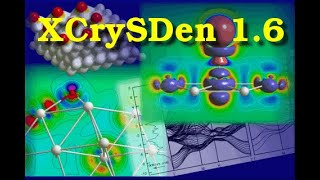
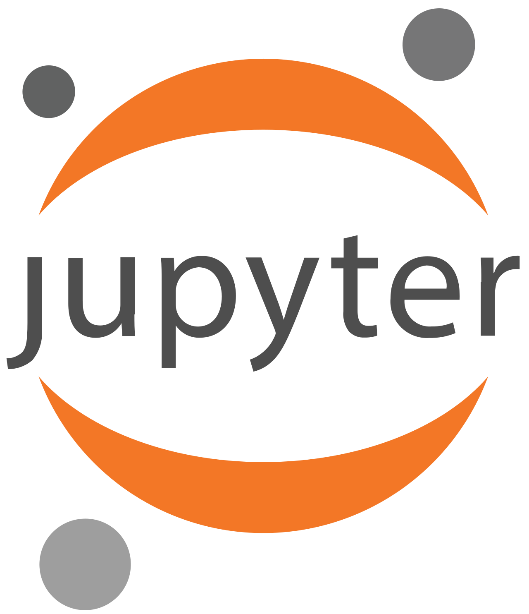

<h1 align="center">Jose Arturo Garcia Cortes 👋</h1>
<align="left"> Hi! My name is Jose and I'm a second year PhD student in the <a href="https://graeve.ucsd.edu/">Xtreme Materials Laboratory</a> at Univeristy of California San Diego. My research primarily focuses on the effects of rare-earth-doping on the structure and electronic properties of bioceramics. As a secondary-project, I investigate the Li-adsoprtion mechanism and Li-doping effects on two-dimensional metal hexaborides. My work integrates High-Performance Computing, Quantum Chemistry and Machine Learning methods to understand, design and optimize materials that serve in biomedical, neutron-detection and energy applications.

<h3 align="left">Skills & tools:</h3>

  <table>
    <tr align="center">
      <td align="center" width="220" bgcolor="#10141D" style="border: 2px solid #89CFF0; border-radius: 8px;">
        <a href="https://www.quantum-espresso.org/">
           
          
            
          <b>Quantum ESPRESSO</b>
            
        </a>
      </td>
      <td align="center" width="220" bgcolor="#10141D" style="border: 2px solid #89CFF0; border-radius: 8px;">
        <a href="https://jp-minerals.org/vesta/en/">
           
          
            
          <b>VESTA</b>
            
        </a>
      </td>
      <td align="center" width="220" bgcolor="#10141D" style="border: 2px solid #89CFF0; border-radius: 8px;">
        <a href="https://ase-lib.org/">
           
          
            
          <b>Atomistic Simulation Environment</b>
            
        </a>
      </td>
      <td align="center" width="220" bgcolor="#10141D" style="border: 2px solid #89CFF0; border-radius: 8px;">
        <a href="http://www.xcrysden.org/">
           
          
            
          <b>XCrySDen</b>
            
        </a>
      </td>
            <td align="center" width="220" bgcolor="#10141D" style="border: 2px solid #89CFF0; border-radius: 8px;">
        <a href="https://ase-lib.org/">
           
          
            
          <b>Atomistic Simulation Environment</b>
            
        </a>
      </td>
      <td align="center" width="220" bgcolor="#10141D" style="border: 2px solid #89CFF0; border-radius: 8px;">
        <a href="https://scikit-learn.org/stable/">
           
          
            
          <b>Scikit-learn</b>
            
        </a>
      </td>
    </tr>
  </table>

<h3 align="left">Programming & Scripting:</h3>

  <table>
    <tr align="center">
      <td align="center" width="220" bgcolor="#10141D" style="border: 2px solid #89CFF0; border-radius: 8px;">
        <a href="https://www.python.org/">
           
          
            
          <b>Python</b>
            
        </a>
      </td>
      <td align="center" width="220" bgcolor="#10141D" style="border: 2px solid #89CFF0; border-radius: 8px;">
        <a href="">
           
          
            
          <b>Bash</b>
            
        </a>
      </td>
      <td align="center" width="220" bgcolor="#10141D" style="border: 2px solid #89CFF0; border-radius: 8px;">
        <a href="https://jupyter.org/">
           
          
            
          <b>Jupyter Lab/Notebooks</b>
            
        </a>
      </td>
    </tr>
  </table>

<h2>💻 Computational Materials Science Projects</h2>

- [Predicting Silver Nanoparticles Size Using Machine Learning Algorithms and Neural Networks in Python](https://github.com/Arturo-GarciaCortes/Ag-Nanoparticles-Size-Prediction-with-Machine-Learning.git)
  
- [Quantum ESPRESSO Input File Generator from Various Format Options](https://github.com/Arturo-GarciaCortes/Quantum-ESPRESSO-input-file-generator-from-cif-xyz-vasp-and-sdf-formats.git)
  
- [Automatizing Quantum ESPRESSO Installation and Compilation with Libxc enabling Parallel Execution using Python3](https://github.com/Arturo-GarciaCortes/Automatizing-Quantum-ESPRESSO-installation-and-configuration-enabling-parallel-excecution-and-Libxc.git)

- [More useful scripts for materials modeling using Quantum ESPRESSO](https://github.com/Arturo-GarciaCortes/Scripts.git)

<h2>🎓 Courses & Certifications</h2>

- [Quantum MultiScale School by Boise State University](http://www.quantum-multiscale.org/q-ms-school-2024-program.html)

- [Advanced Learning Algorithms by DeepLearning.AI & Stanford University](https://drive.google.com/file/d/1Rsg8FgptcwTl5xn7r-pQHc7SVNF06U9V/view?usp=sharing)

- [Supervised Machine Learning: Regression and Classification by DeepLearning.AI & Stanford University](https://drive.google.com/file/d/1BzpukPOWcF09NunAimP-yOgXbtiHAfSC/view?usp=sharing)

- [Python for Data Science, AI & Development by IBM Skills Network](https://drive.google.com/file/d/1gh4IJJw7OOeYGuwhrm6ZWmirooaV8NDo/view?usp=sharing)

- [Introduction to Digital Skills by Santander Scolarships](https://drive.google.com/file/d/1mB8e3_UM3U3AjJPHF50Ft86FQdEIsqdn/view?usp=sharing)

- [Second International seminar of Bionanotechnology by LEBENS Training Company](https://drive.google.com/file/d/1p1UOjvH8y7ZcNBcjlMbJz-OSqd6StX6C/view?usp=sharing)

- [Introduction to the 5 generations of Nanotechnology by Instituto de Nanotecnologia Aplicada](https://drive.google.com/file/d/1PYfPHUZ5kdYfUropNCbftOZUmelv38QZ/view?usp=sharing)

📄 Look at the extent of my background and achievements: [Curriculum Vitae](https://drive.google.com/file/d/1HiAMa4oiPp1z2bXPGnwee2KfQ1QTN9OC/view?usp=sharing)

<h2>🌎 Connect with me</h2>

📫 Reach me at: garciacortesjosearturo@gmail.com

